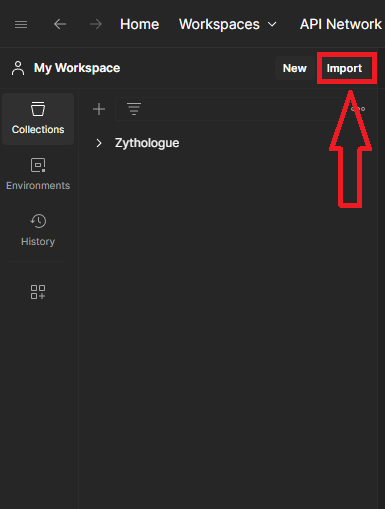

# Zythologue API


## Lancement du projet

Vous devez tout d'abord cloner le projet 

    git clone https://github.com/2024-cda-boulogne/zythologueAPI-tdu.git

Ensuite ouvrir un terminal depuis le répertoire et executer

    docker-compose up --build -d

Attendez quelques seconde le temps que le build s'effectue, lorsque que tout est initialisés rendez vous sur l'adresse suivant

    http:/localhost:8080/

Vous arriver sur le swagger de l'api à partir d'ici vous pouver executer des requêtes

## Postman

Après avoir lancé le docker vous pouvez récuperer le fichier situé dans la racine du projet
```
    Zythologue.postman_collection.json
```
    

Après vous pouvez l'importer dans postman



Puis drop le fichier dans l'encadrer

Lorsque vous avez importer le projet vous pouvez lancer les requêtes.

## EVALUATION
