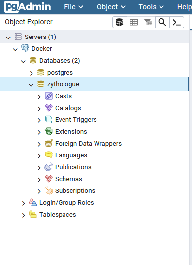
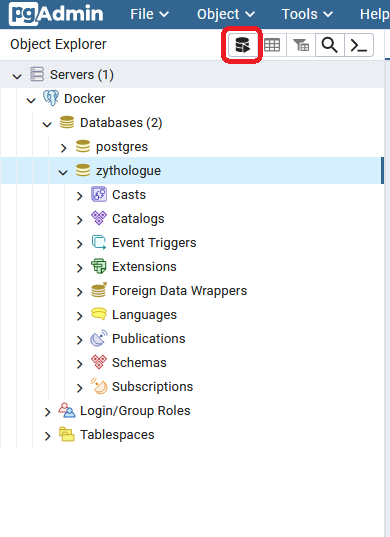
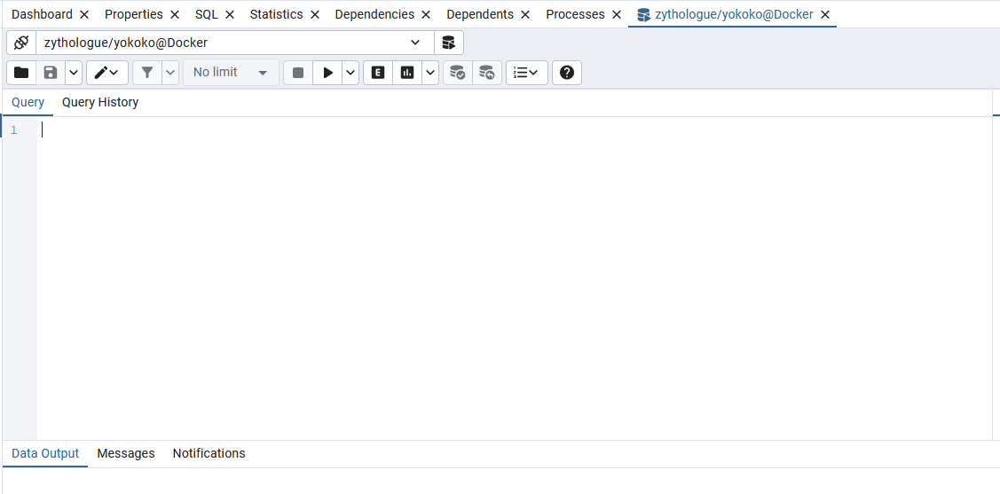

# zythologue_TD

## Initialisation du projet

### Docker

Vous devez tout d'abord télécharger docker.

https://www.docker.com/

Après l'installation ouvrir un terminal depuis le dossier du projet et executer la commande suivante:
```
    docker-compose up --build -d
```
Cela va crée un container qui va automatiquement initialiser la base de données et vous connecter au serveur postgres sur pgAdmin

### PgAdmin

Après avoir exectuer docker patienter un instant puis aller sur l'adresse suivante

http://localhost:5050

Ensuite ouvrir la base de données



Puis executer les requêtes appuyer sur le bouton query après avoir cliqué sur la base de données 





Avoir avoir écrit la requête appuyer sur f5 ou le bouton play pour exectuer la query

